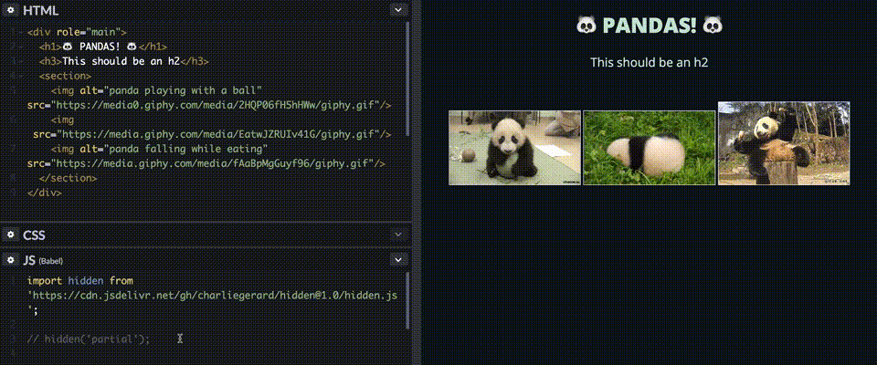

# Hidden.js

With the aim to sensitise people to improve the accessibility of their websites, this script will make non-accessible elements invisible to everyone, until their accessiblity issues are fixed.

## Demos

I wrote a quick [Codepen](https://codepen.io/charliegerard/pen/PVvqQO?editors=1010) if you want to play around with the following demos.

### **Full option**

Decreases the opacity of the full page based on the total number of errors found.


### **Partial option**

Makes the inaccessible elements totally invisible to everyone.




## How does it work

It uses the [axe-core](https://github.com/dequelabs/axe-core) accessibility engine to scan through the code and find accessibility issues.

Then, depending on the mode selected (`full` or `partial`), it either decreases the level of opacity of the entire page based on the number of errors found, or makes only the unaccessible elements totally invisible.

## How to use

To add the script to your project, add the following line in your main `js` file:

```javascript
import hidden from 'https://cdn.jsdelivr.net/gh/charliegerard/hidden@latest/hidden.js';
```

or download `hidden.js` from this repo and add it to your project.

To start the script, write either:

```javascript
hidden() // with no parameters if you want to use the default ones.
```

or

```javascript
hidden('full', 2); // the full mode takes a parameter for the max number of errors accepted;
```

or

```javascript
hidden('partial'); // partial does not need a max number of errors;
```

## Options

The script takes 2 arguments:

* A mode: `full` or `partial`
* A maximum number of errors tolerated.

If you don't specify these parameters when calling `hidden`, the default values will be used ('full' and 10).
